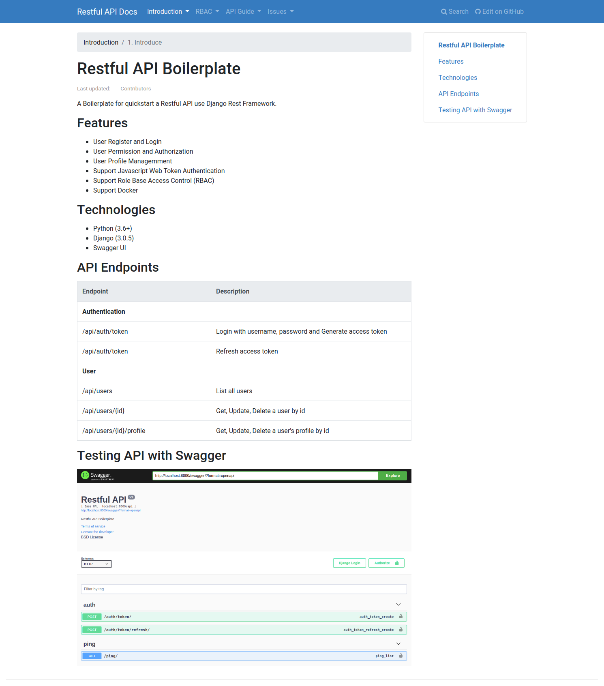

# Django Restful API Boilerplate

A Boilerplate for quickstart a Restful APIs use Django Rest Framework, PostgresQL.

## Features

- [x] User Register and Login
- [x] User permission and authorization
- [x] User Profile managemment 

## Tecnologies

- [x] Support Javascript Web Token Authentication
- [x] Support Role Base Access Control (RBAC)
- [x] Support Docker

## Restful APIs

| Endpoint     | Technical | Details           |
|--------------|-----------|-------------------|
| /products    | gRPC      | List all products |
| /products/id | gRPC      |                   |
|              |           |                   |

## Quickstart

### Setup project

Create python virtualenv

```shell
virtualenv -p python3 venv
source venv/bin/activate
pip install -r requirements.txt
```

Create a new superuser

```shell
# Demo user: admin | @dm1n#123 | admin@example.com
# Demo user: mobileuser | M@bile123 | mobileuser@example.com

python3 manage.py createsuperuser
```

```shell
python3 manage.py makemigrations
python3 manage.py migrate
```

Test RestAPI with Postman

## Documentation

This project use mkdocs for create document for other developers can works.

Start docs site

```shell
mkdocs serve --dev-addr=127.0.0.1:8001
```

## Testing 

- Create sample data
- Write test case with sample data 

## User Guide

Full document to guide user about Django Restful API Boilerplate.



## References

- [Django Rest Framework](https://django-rest-framework-simplejwt.readthedocs.io/en/latest/getting_started.html#requirements)
- [JWT Authentication](https://pypi.org/project/djangorestframework-simplejwt/)
- [Swagger with Django Rest Framework](https://drf-yasg.readthedocs.io/en/stable/readme.html)


